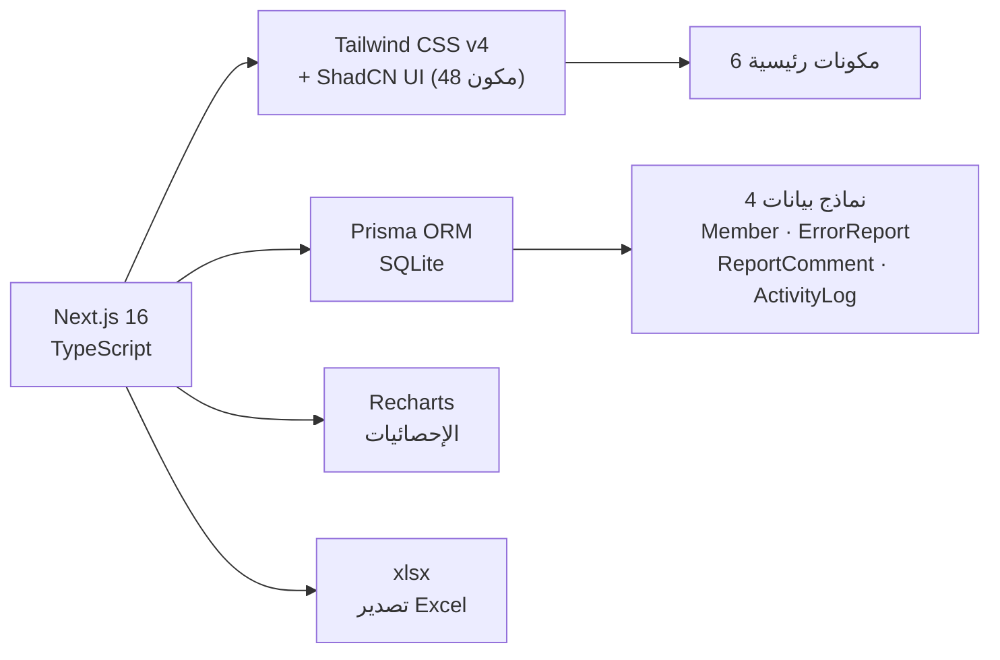

# خطة التطوير الاحترافي الشاملة — منصة تتبع أخطاء مرسم تدبر

## الوضع الحالي للمشروع



| العنصر | القيمة |
|---|---|
| **الإطار** | Next.js 16.1 + React 19 + TypeScript 5 |
| **التنسيق** | Tailwind CSS v4 + ShadCN/ui (48 مكوناً) + tw-animate-css |
| **قاعدة البيانات** | Prisma 6.11 + SQLite |
| **الخطوط الحالية** | Cairo (نص عام) · Amiri (عناوين) · IBM Plex Mono (أرقام) |
| **واجهات API** | 10 نقاط نهاية (CRUD للأعضاء والبلاغات + إحصائيات + تصدير Excel + بذر بيانات) |
| **المكونات الرئيسية** | app-header · dashboard · new-report-form · reports-list · members-manager · chips |
| **الاتجاه** | RTL (عربي بالكامل) |

---

## المرحلة ① — تحديث الخطوط (Typography Overhaul)

### تشخيص المشكلة

| الخط الحالي | المشكلة |
|---|---|
| **Cairo** (sans) | تقليدي، سُمك الخط ثقيل نسبياً، لا يعطي شعور التطبيقات الحديثة |
| **Amiri** (serif/نسخي) | مصمم للمطبوعات الورقية والكتب، ثقيل بصرياً جداً كعنوان في تطبيق ويب، ضعيف الوضوح في الأحجام الصغيرة |
| **IBM Plex Mono** | جيد لكنه عريض، ليس الأمثل لعرض الأرقام في بطاقات صغيرة |

### الحل: 3 خطوط جديدة

| الخط الجديد | الاستخدام | لماذا هذا الخط تحديداً؟ |
|---|---|---|
| **Tajawal** | النص العام والفقرات (`--font-sans`) | خفيف الوزن، حروف مستديرة وانسيابية، مقروئية ممتازة على الشاشات، مسافات بين الحروف متوازنة — من أفضل خطوط Google العربية للواجهات |
| **Alexandria** | العناوين والعلامة التجارية (`--font-serif`) | تصميم هندسي (Geometric Sans-Serif)، حديث وأنيق، يدعم 8 أوزان، يعطي طابعاً احترافياً للعناوين دون ثقل الخطوط النسخية |
| **JetBrains Mono** | الأرقام وحقول الكود (`--font-mono`) | مصمم خصيصاً للمطورين، تبايُن واضح بين الأرقام (0 vs O, 1 vs l)، أضيق من IBM Plex مما يناسب البطاقات |

### التغييرات الدقيقة

#### [MODIFY] [layout.tsx](file:///c:/Users/WWW/Desktop/pro%20eslam/%E2%80%8F%E2%80%8F%E2%80%8F%E2%80%8F%E2%80%8F%E2%80%8F%E2%80%8F%E2%80%8F%E2%80%8F%E2%80%8F%E2%80%8F%E2%80%8F%E2%80%8F%E2%80%8Fproject%20-%20claude/%D9%85%D9%86%D8%B5%D8%A9%20%D8%AA%D8%AA%D8%A8%D8%B9%20%D8%A3%D8%AE%D8%B7%D8%A7%D8%A1%20%D8%B3%D8%AA%D8%A7%D9%8A%D9%84%20%D9%85%D9%86%D8%AF%D9%84%D9%8A/src/app/layout.tsx)

**السطر 2**: تغيير الاستيرادات
```diff
- import { Cairo, Amiri, IBM_Plex_Mono } from "next/font/google";
+ import { Tajawal, Alexandria, JetBrains_Mono } from "next/font/google";
```

**الأسطر 7-26**: تبديل تعريفات الخطوط
```diff
- const cairo = Cairo({
-   variable: "--font-cairo",
-   subsets: ["arabic", "latin"],
-   weight: ["400", "500", "600", "700", "800"],
+ const tajawal = Tajawal({
+   variable: "--font-tajawal",
+   subsets: ["arabic", "latin"],
+   weight: ["300", "400", "500", "700", "800"],
    display: "swap",
  });

- const amiri = Amiri({
-   variable: "--font-amiri",
-   subsets: ["arabic", "latin"],
-   weight: ["400", "700"],
+ const alexandria = Alexandria({
+   variable: "--font-alexandria",
+   subsets: ["arabic", "latin"],
+   weight: ["300", "400", "500", "600", "700", "800"],
    display: "swap",
  });

- const ibmMono = IBM_Plex_Mono({
-   variable: "--font-ibm-mono",
-   subsets: ["latin"],
-   weight: ["400", "500"],
+ const jetbrainsMono = JetBrains_Mono({
+   variable: "--font-jetbrains",
+   subsets: ["latin"],
+   weight: ["400", "500", "600"],
    display: "swap",
  });
```

**السطر 52**: تحديث متغيرات CSS في الـ body
```diff
- className={`${cairo.variable} ${amiri.variable} ${ibmMono.variable} antialiased ...`}
+ className={`${tajawal.variable} ${alexandria.variable} ${jetbrainsMono.variable} antialiased ...`}
```

#### [MODIFY] [globals.css](file:///c:/Users/WWW/Desktop/pro%20eslam/%E2%80%8F%E2%80%8F%E2%80%8F%E2%80%8F%E2%80%8F%E2%80%8F%E2%80%8F%E2%80%8F%E2%80%8F%E2%80%8F%E2%80%8F%E2%80%8F%E2%80%8F%E2%80%8Fproject%20-%20claude/%D9%85%D9%86%D8%B5%D8%A9%20%D8%AA%D8%AA%D8%A8%D8%B9%20%D8%A3%D8%AE%D8%B7%D8%A7%D8%A1%20%D8%B3%D8%AA%D8%A7%D9%8A%D9%84%20%D9%85%D9%86%D8%AF%D9%84%D9%8A/src/app/globals.css) — الأسطر 9-11

```diff
- --font-sans: var(--font-cairo), "Cairo", system-ui, sans-serif;
- --font-serif: var(--font-amiri), "Amiri", serif;
- --font-mono: var(--font-ibm-mono), "IBM Plex Mono", monospace;
+ --font-sans: var(--font-tajawal), "Tajawal", system-ui, sans-serif;
+ --font-serif: var(--font-alexandria), "Alexandria", sans-serif;
+ --font-mono: var(--font-jetbrains), "JetBrains Mono", monospace;
```

#### [MODIFY] [globals.css](file:///c:/Users/WWW/Desktop/pro%20eslam/%E2%80%8F%E2%80%8F%E2%80%8F%E2%80%8F%E2%80%8F%E2%80%8F%E2%80%8F%E2%80%8F%E2%80%8F%E2%80%8F%E2%80%8F%E2%80%8F%E2%80%8F%E2%80%8Fproject%20-%20claude/%D9%85%D9%86%D8%B5%D8%A9%20%D8%AA%D8%AA%D8%A8%D8%B9%20%D8%A3%D8%AE%D8%B7%D8%A7%D8%A1%20%D8%B3%D8%AA%D8%A7%D9%8A%D9%84%20%D9%85%D9%86%D8%AF%D9%84%D9%8A/src/app/globals.css) — الأسطر 169-173 (`.font-display`)

```diff
  .font-display {
    font-family: var(--font-serif);
-   font-weight: 700;
-   letter-spacing: -0.01em;
+   font-weight: 600;
+   letter-spacing: 0.01em;
  }
```

> [!NOTE]
> **لماذا `font-weight: 600` بدلاً من `700`؟** لأن Alexandria بوزن 600 (Semi-Bold) أكثر أناقة من Bold في العناوين، بينما كان Amiri يحتاج 700 لأنه خط نسخي.

---

## المرحلة ② — تحسين أحجام النصوص والمقروئية

### تشخيص المشكلة

بحثت في جميع المكونات الستة ووجدت أن أحجام النصوص الصغيرة (`text-[10px]`, `text-[11px]`) تتكرر في **42 موضعاً** عبر الملفات، مما يضر المقروئية خاصة على الشاشات الصغيرة.

### قاعدة الحد الأدنى

| الحجم الحالي | الحجم الجديد | المعيار |
|---|---|---|
| `text-[10px]` → | `text-xs` (12px) | الحد الأدنى المقبول لأي نص مقروء |
| `text-[11px]` → | `text-xs` (12px) | توحيد مع الحد الأدنى |
| `text-[13px]` → | `text-sm` (14px) | المحتوى العادي يستحق حجماً مريحاً |

### خريطة التعديلات لكل ملف

#### [MODIFY] [app-header.tsx](file:///c:/Users/WWW/Desktop/pro%20eslam/%E2%80%8F%E2%80%8F%E2%80%8F%E2%80%8F%E2%80%8F%E2%80%8F%E2%80%8F%E2%80%8F%E2%80%8F%E2%80%8F%E2%80%8F%E2%80%8F%E2%80%8F%E2%80%8Fproject%20-%20claude/%D9%85%D9%86%D8%B5%D8%A9%20%D8%AA%D8%AA%D8%A8%D8%B9%20%D8%A3%D8%AE%D8%B7%D8%A7%D8%A1%20%D8%B3%D8%AA%D8%A7%D9%8A%D9%84%20%D9%85%D9%86%D8%AF%D9%84%D9%8A/src/components/app-header.tsx) — 5 مواضع

| السطر | الحالي | الجديد | العنصر |
|---|---|---|---|
| 54 | `text-[10px]` | `text-xs` | نص "TADABBUR" في الختم |
| 61 | `text-[11px]` | `text-xs` | عنوان "TADABBUR · CSL STUDIO" |
| 194 | `text-[10px]` | `text-xs` | دور العضو الحالي في البطاقة |

#### [MODIFY] [dashboard.tsx](file:///c:/Users/WWW/Desktop/pro%20eslam/%E2%80%8F%E2%80%8F%E2%80%8F%E2%80%8F%E2%80%8F%E2%80%8F%E2%80%8F%E2%80%8F%E2%80%8F%E2%80%8F%E2%80%8F%E2%80%8F%E2%80%8F%E2%80%8Fproject%20-%20claude/%D9%85%D9%86%D8%B5%D8%A9%20%D8%AA%D8%AA%D8%A8%D8%B9%20%D8%A3%D8%AE%D8%B7%D8%A7%D8%A1%20%D8%B3%D8%AA%D8%A7%D9%8A%D9%84%20%D9%85%D9%86%D8%AF%D9%84%D9%8A/src/components/dashboard.tsx) — ~15 موضع
- كل `text-[10px]` → `text-xs` (تسميات البطاقات، أسماء المحاور في الرسوم البيانية)
- كل `text-[11px]` → `text-xs` (التواريخ في سجل النشاط)
- كل `text-[13px]` → `text-sm` (أسماء الأعضاء في لوحة الإحصائيات)

#### [MODIFY] [reports-list.tsx](file:///c:/Users/WWW/Desktop/pro%20eslam/%E2%80%8F%E2%80%8F%E2%80%8F%E2%80%8F%E2%80%8F%E2%80%8F%E2%80%8F%E2%80%8F%E2%80%8F%E2%80%8F%E2%80%8F%E2%80%8F%E2%80%8F%E2%80%8Fproject%20-%20claude/%D9%85%D9%86%D8%B5%D8%A9%20%D8%AA%D8%AA%D8%A8%D8%B9%20%D8%A3%D8%AE%D8%B7%D8%A7%D8%A1%20%D8%B3%D8%AA%D8%A7%D9%8A%D9%84%20%D9%85%D9%86%D8%AF%D9%84%D9%8A/src/components/reports-list.tsx) — ~12 موضع
- أحجام التواريخ والموقع ورقم الصفحة والحقل

#### [MODIFY] [new-report-form.tsx](file:///c:/Users/WWW/Desktop/pro%20eslam/%E2%80%8F%E2%80%8F%E2%80%8F%E2%80%8F%E2%80%8F%E2%80%8F%E2%80%8F%E2%80%8F%E2%80%8F%E2%80%8F%E2%80%8F%E2%80%8F%E2%80%8F%E2%80%8Fproject%20-%20claude/%D9%85%D9%86%D8%B5%D8%A9%20%D8%AA%D8%AA%D8%A8%D8%B9%20%D8%A3%D8%AE%D8%B7%D8%A7%D8%A1%20%D8%B3%D8%AA%D8%A7%D9%8A%D9%84%20%D9%85%D9%86%D8%AF%D9%84%D9%8A/src/components/new-report-form.tsx) — ~5 مواضع
- وصف أنواع البلاغات وتسميات الحقول

#### [MODIFY] [members-manager.tsx](file:///c:/Users/WWW/Desktop/pro%20eslam/%E2%80%8F%E2%80%8F%E2%80%8F%E2%80%8F%E2%80%8F%E2%80%8F%E2%80%8F%E2%80%8F%E2%80%8F%E2%80%8F%E2%80%8F%E2%80%8F%E2%80%8F%E2%80%8Fproject%20-%20claude/%D9%85%D9%86%D8%B5%D8%A9%20%D8%AA%D8%AA%D8%A8%D8%B9%20%D8%A3%D8%AE%D8%B7%D8%A7%D8%A1%20%D8%B3%D8%AA%D8%A7%D9%8A%D9%84%20%D9%85%D9%86%D8%AF%D9%84%D9%8A/src/components/members-manager.tsx) — ~5 مواضع
- تاريخ انضمام العضو، تسميات الإحصائيات

#### [MODIFY] [chips.tsx](file:///c:/Users/WWW/Desktop/pro%20eslam/%E2%80%8F%E2%80%8F%E2%80%8F%E2%80%8F%E2%80%8F%E2%80%8F%E2%80%8F%E2%80%8F%E2%80%8F%E2%80%8F%E2%80%8F%E2%80%8F%E2%80%8F%E2%80%8Fproject%20-%20claude/%D9%85%D9%86%D8%B5%D8%A9%20%D8%AA%D8%AA%D8%A8%D8%B9%20%D8%A3%D8%AE%D8%B7%D8%A7%D8%A1%20%D8%B3%D8%AA%D8%A7%D9%8A%D9%84%20%D9%85%D9%86%D8%AF%D9%84%D9%8A/src/components/chips.tsx)
- الشارات (TypeChip, SeverityChip, StatusChip) حالياً `text-xs` — ستبقى كما هي ✅
- زيادة padding الأفقي: `px-2` → `px-2.5` لراحة بصرية

---

## المرحلة ③ — تحسين التصميم البصري (Visual Polish)

### 3.1 — إضافات CSS جديدة في [globals.css](file:///c:/Users/WWW/Desktop/pro%20eslam/%E2%80%8F%E2%80%8F%E2%80%8F%E2%80%8F%E2%80%8F%E2%80%8F%E2%80%8F%E2%80%8F%E2%80%8F%E2%80%8F%E2%80%8F%E2%80%8F%E2%80%8F%E2%80%8Fproject%20-%20claude/%D9%85%D9%86%D8%B5%D8%A9%20%D8%AA%D8%AA%D8%A8%D8%B9%20%D8%A3%D8%AE%D8%B7%D8%A7%D8%A1%20%D8%B3%D8%AA%D8%A7%D9%8A%D9%84%20%D9%85%D9%86%D8%AF%D9%84%D9%8A/src/app/globals.css)

```css
/* ① حركة انزلاق للعناصر — مناسبة لـ RTL */
@keyframes slideInRight {
  from { opacity: 0; transform: translateX(20px); }
  to   { opacity: 1; transform: translateX(0); }
}
.slide-in { animation: slideInRight 0.35s ease both; }

/* ② نبض ذهبي ناعم للإشعارات والعناصر المهمة */
@keyframes pulseGold {
  0%, 100% { box-shadow: 0 0 0 0 rgba(201, 162, 75, 0.3); }
  50%      { box-shadow: 0 0 0 6px rgba(201, 162, 75, 0); }
}
.pulse-gold { animation: pulseGold 2s ease-in-out infinite; }

/* ③ لوح زجاجي (Glassmorphism) */
.glass-panel {
  background: rgba(25, 20, 13, 0.75);
  backdrop-filter: blur(16px);
  -webkit-backdrop-filter: blur(16px);
  border: 1px solid rgba(201, 162, 75, 0.18);
  border-radius: var(--radius);
}

/* ④ تحسين fadeUp بإضافة blur */
@keyframes fadeUp {
  from { opacity: 0; transform: translateY(10px); filter: blur(4px); }
  to   { opacity: 1; transform: translateY(0); filter: blur(0); }
}

/* ⑤ تحسين glow-hover */
.glow-hover {
  transition: box-shadow 0.3s ease, transform 0.25s ease;
}
.glow-hover:hover {
  box-shadow: 0 0 0 1px rgba(201, 162, 75, 0.4), 
              0 16px 48px rgba(201, 162, 75, 0.1),
              0 4px 12px rgba(0, 0, 0, 0.3);
  transform: translateY(-2px);
}

/* ⑥ فاصل ذهبي متدرج (لاستخدامه في التذييل) */
.gold-divider {
  height: 1px;
  background: linear-gradient(90deg, transparent, rgba(201,162,75,0.4), transparent);
}
```

### 3.2 — تحسينات مكون الهيدر [app-header.tsx](file:///c:/Users/WWW/Desktop/pro%20eslam/%E2%80%8F%E2%80%8F%E2%80%8F%E2%80%8F%E2%80%8F%E2%80%8F%E2%80%8F%E2%80%8F%E2%80%8F%E2%80%8F%E2%80%8F%E2%80%8F%E2%80%8F%E2%80%8Fproject%20-%20claude/%D9%85%D9%86%D8%B5%D8%A9%20%D8%AA%D8%AA%D8%A8%D8%B9%20%D8%A3%D8%AE%D8%B7%D8%A7%D8%A1%20%D8%B3%D8%AA%D8%A7%D9%8A%D9%84%20%D9%85%D9%86%D8%AF%D9%84%D9%8A/src/components/app-header.tsx)

- شريط التبويبات (سطر 224): إضافة تأثير `active indicator` متحرك أسفل التبويب النشط بدلاً من تغيير الخلفية فقط
- تحسين تأثير hover على أزرار التبويبات بانتقال أنعم

### 3.3 — تحسينات لوحة القيادة [dashboard.tsx](file:///c:/Users/WWW/Desktop/pro%20eslam/%E2%80%8F%E2%80%8F%E2%80%8F%E2%80%8F%E2%80%8F%E2%80%8F%E2%80%8F%E2%80%8F%E2%80%8F%E2%80%8F%E2%80%8F%E2%80%8F%E2%80%8F%E2%80%8Fproject%20-%20claude/%D9%85%D9%86%D8%B5%D8%A9%20%D8%AA%D8%AA%D8%A8%D8%B9%20%D8%A3%D8%AE%D8%B7%D8%A7%D8%A1%20%D8%B3%D8%AA%D8%A7%D9%8A%D9%84%20%D9%85%D9%86%D8%AF%D9%84%D9%8A/src/components/dashboard.tsx)

- بطاقات KPI: تحسين التدرجات اللونية وإضافة خط ذهبي سفلي `.gold-rule`
- رسوم Recharts: زوايا مستديرة لأعمدة الـ BarChart (`radius={[4,4,0,0]}`)
- تحسين حالة التحميل (Skeleton) بتحريك أكثر سلاسة

### 3.4 — تحسينات نموذج البلاغ [new-report-form.tsx](file:///c:/Users/WWW/Desktop/pro%20eslam/%E2%80%8F%E2%80%8F%E2%80%8F%E2%80%8F%E2%80%8F%E2%80%8F%E2%80%8F%E2%80%8F%E2%80%8F%E2%80%8F%E2%80%8F%E2%80%8F%E2%80%8F%E2%80%8Fproject%20-%20claude/%D9%85%D9%86%D8%B5%D8%A9%20%D8%AA%D8%AA%D8%A8%D8%B9%20%D8%A3%D8%AE%D8%B7%D8%A7%D8%A1%20%D8%B3%D8%AA%D8%A7%D9%8A%D9%84%20%D9%85%D9%86%D8%AF%D9%84%D9%8A/src/components/new-report-form.tsx)

- تحسين بطاقات اختيار النوع بتأثير hover أنعم مع scale خفيف
- إضافة حلقة تركيز ذهبية واضحة (`focus-visible:ring`) على حقول الإدخال

### 3.5 — تحسينات قائمة البلاغات [reports-list.tsx](file:///c:/Users/WWW/Desktop/pro%20eslam/%E2%80%8F%E2%80%8F%E2%80%8F%E2%80%8F%E2%80%8F%E2%80%8F%E2%80%8F%E2%80%8F%E2%80%8F%E2%80%8F%E2%80%8F%E2%80%8F%E2%80%8F%E2%80%8Fproject%20-%20claude/%D9%85%D9%86%D8%B5%D8%A9%20%D8%AA%D8%AA%D8%A8%D8%B9%20%D8%A3%D8%AE%D8%B7%D8%A7%D8%A1%20%D8%B3%D8%AA%D8%A7%D9%8A%D9%84%20%D9%85%D9%86%D8%AF%D9%84%D9%8A/src/components/reports-list.tsx)

- استبدال `window.confirm()` بمكون `AlertDialog` من ShadCN (المكون مُثبَّت بالفعل ولم يكن مُستخدماً)
- تحسين ظلال بطاقات البلاغات

### 3.6 — تحسينات إدارة الأعضاء [members-manager.tsx](file:///c:/Users/WWW/Desktop/pro%20eslam/%E2%80%8F%E2%80%8F%E2%80%8F%E2%80%8F%E2%80%8F%E2%80%8F%E2%80%8F%E2%80%8F%E2%80%8F%E2%80%8F%E2%80%8F%E2%80%8F%E2%80%8F%E2%80%8Fproject%20-%20claude/%D9%85%D9%86%D8%B5%D8%A9%20%D8%AA%D8%AA%D8%A8%D8%B9%20%D8%A3%D8%AE%D8%B7%D8%A7%D8%A1%20%D8%B3%D8%AA%D8%A7%D9%8A%D9%84%20%D9%85%D9%86%D8%AF%D9%84%D9%8A/src/components/members-manager.tsx)

- استبدال `window.confirm()` بـ `AlertDialog`
- تكبير دوائر منتقي الألوان من `22px` إلى `28px` لسهولة النقر

### 3.7 — تحسينات الصفحة الرئيسية [page.tsx](file:///c:/Users/WWW/Desktop/pro%20eslam/%E2%80%8F%E2%80%8F%E2%80%8F%E2%80%8F%E2%80%8F%E2%80%8F%E2%80%8F%E2%80%8F%E2%80%8F%E2%80%8F%E2%80%8F%E2%80%8F%E2%80%8F%E2%80%8Fproject%20-%20claude/%D9%85%D9%86%D8%B5%D8%A9%20%D8%AA%D8%AA%D8%A8%D8%B9%20%D8%A3%D8%AE%D8%B7%D8%A7%D8%A1%20%D8%B3%D8%AA%D8%A7%D9%8A%D9%84%20%D9%85%D9%86%D8%AF%D9%84%D9%8A/src/app/page.tsx)

- تحسين التذييل: استبدال `border-top` بـ `.gold-divider` المتدرج
- تكبير حجم خط التذييل من `text-[11px]` إلى `text-xs`

### 3.8 — تحسينات الشارات [chips.tsx](file:///c:/Users/WWW/Desktop/pro%20eslam/%E2%80%8F%E2%80%8F%E2%80%8F%E2%80%8F%E2%80%8F%E2%80%8F%E2%80%8F%E2%80%8F%E2%80%8F%E2%80%8F%E2%80%8F%E2%80%8F%E2%80%8F%E2%80%8Fproject%20-%20claude/%D9%85%D9%86%D8%B5%D8%A9%20%D8%AA%D8%AA%D8%A8%D8%B9%20%D8%A3%D8%AE%D8%B7%D8%A7%D8%A1%20%D8%B3%D8%AA%D8%A7%D9%8A%D9%84%20%D9%85%D9%86%D8%AF%D9%84%D9%8A/src/components/chips.tsx)

- زيادة padding الأفقي: `px-2` → `px-2.5`
- زيادة padding العمودي: `py-0.5` → `py-1`

---

## المرحلة ④ — إصلاح مشاكل تقنية مُكتشفة

> [!WARNING]
> خلال البحث في المشروع، تم اكتشاف عدة مشاكل تقنية تستحق الإصلاح. هذه ليست تغييرات بصرية لكنها تحسن جودة الكود واستقراره.

### 4.1 — حذف ملف إعدادات ميت

#### [DELETE] [tailwind.config.ts](file:///c:/Users/WWW/Desktop/pro%20eslam/%E2%80%8F%E2%80%8F%E2%80%8F%E2%80%8F%E2%80%8F%E2%80%8F%E2%80%8F%E2%80%8F%E2%80%8F%E2%80%8F%E2%80%8F%E2%80%8F%E2%80%8F%E2%80%8Fproject%20-%20claude/%D9%85%D9%86%D8%B5%D8%A9%20%D8%AA%D8%AA%D8%A8%D8%B9%20%D8%A3%D8%AE%D8%B7%D8%A7%D8%A1%20%D8%B3%D8%AA%D8%A7%D9%8A%D9%84%20%D9%85%D9%86%D8%AF%D9%84%D9%8A/tailwind.config.ts)

**السبب**: هذا الملف يستخدم نمط Tailwind v3 (`hsl(var(--...))`) لكن المشروع يعمل بـ **Tailwind v4** الذي يقرأ الإعدادات من `@theme inline` في `globals.css` مباشرة. الملف:
- يلف الألوان بـ `hsl()` لكن المتغيرات في CSS تستخدم **hex خام** (#100d09) وليس قنوات HSL — مما يُنتج CSS غير صالح مثل `hsl(#100d09)`
- مسارات `content` لا تتضمن `src/` — لكن Tailwind v4 يكتشف المحتوى تلقائياً
- الإعدادات مكررة بالكامل في `globals.css`

### 4.2 — إصلاح إعدادات Next.js

#### [MODIFY] [next.config.ts](file:///c:/Users/WWW/Desktop/pro%20eslam/%E2%80%8F%E2%80%8F%E2%80%8F%E2%80%8F%E2%80%8F%E2%80%8F%E2%80%8F%E2%80%8F%E2%80%8F%E2%80%8F%E2%80%8F%E2%80%8F%E2%80%8F%E2%80%8Fproject%20-%20claude/%D9%85%D9%86%D8%B5%D8%A9%20%D8%AA%D8%AA%D8%A8%D8%B9%20%D8%A3%D8%AE%D8%B7%D8%A7%D8%A1%20%D8%B3%D8%AA%D8%A7%D9%8A%D9%84%20%D9%85%D9%86%D8%AF%D9%84%D9%8A/next.config.ts)

```diff
  const nextConfig: NextConfig = {
    output: "standalone",
-   typescript: {
-     ignoreBuildErrors: true,
-   },
-   reactStrictMode: false,
+   serverExternalPackages: ["xlsx"],
  };
```

**السبب**: 
- `ignoreBuildErrors: true` يخفي أخطاء TypeScript أثناء البناء — خطير في الإنتاج
- `reactStrictMode: false` يخفي مشاكل محتملة أثناء التطوير

> [!IMPORTANT]
> **هل لديك أخطاء TypeScript تمنع البناء حالياً؟** إذا كان الجواب نعم، سأصلحها بدلاً من تجاهلها. أخبرني وسأعالجها.

---

## المرحلة ⑤ — تشغيل المنصة ومشاركتها مع الفريق

### التشغيل المحلي الفوري

```bash
# 1. تثبيت الاعتماديات
npm install

# 2. إنشاء/تحديث قاعدة البيانات
npx prisma db push

# 3. تشغيل خادم التطوير
npm run dev

# 4. افتح المتصفح على
# http://localhost:3000
```

### خيارات المشاركة مع الفريق

> [!IMPORTANT]
> ### الخيار ① — النشر السحابي على Vercel (الأنسب والأكثر احترافية)
> 
> **لمن؟** فريق موزع في أماكن مختلفة، أو تريد رابطاً دائماً يعمل 24/7.
> 
> **المتطلبات:**
> 1. حساب مجاني على [GitHub](https://github.com) لرفع الكود
> 2. حساب مجاني على [Vercel](https://vercel.com) للاستضافة
> 3. حساب مجاني على [Neon](https://neon.tech) لقاعدة بيانات PostgreSQL سحابية
> 
> **التغييرات المطلوبة في الكود:**
> 
> | الملف | التغيير |
> |---|---|
> | `prisma/schema.prisma` | `provider = "sqlite"` → `provider = "postgresql"` |
> | `.env` | `DATABASE_URL="file:./db/..."` → رابط اتصال Neon |
> 
> **الخطوات:**
> 1. أنشئ مستودع GitHub جديد وارفع المشروع
> 2. سجّل في Neon واحصل على رابط الاتصال (connection string)
> 3. سجّل في Vercel واربطه بالمستودع
> 4. أضف `DATABASE_URL` في Vercel Environment Variables
> 5. انشر — ستحصل على رابط مثل: `https://tadabbur-team.vercel.app`
> 
> **التكلفة:** مجاني بالكامل (Vercel Hobby + Neon Free Tier)
> 
> **الرابط الذي ترسله للفريق:** `https://tadabbur-team.vercel.app` — يعمل من أي مكان، أي جهاز، بدون تثبيت أي شيء.

> [!TIP]
> ### الخيار ② — مشاركة مؤقتة عبر Cloudflare Tunnel (مجاني وسريع)
> 
> **لمن؟** تريد مشاركة سريعة بدون تغيير أي كود.
> 
> **الخطوات:**
> ```bash
> # 1. شغّل البرنامج محلياً
> npm run dev
> 
> # 2. في terminal ثاني، شغّل النفق
> npx cloudflared tunnel --url http://localhost:3000
> ```
> 
> ستحصل على رابط عام مثل: `https://random-name.trycloudflare.com`
> 
> **المميزات:** لا يحتاج حساب، مجاني، لا تغييرات في الكود
> **العيوب:** يتوقف عند إغلاق حاسوبك، الرابط يتغير كل مرة

> [!NOTE]
> ### الخيار ③ — الشبكة المحلية (نفس المكتب/الواي فاي)
> 
> **لمن؟** الفريق في نفس المكان وعلى نفس الشبكة.
> 
> **الخطوات:**
> ```bash
> # 1. شغّل البرنامج مع فتح الشبكة
> npx next dev -p 3000 --hostname 0.0.0.0
> 
> # 2. اعرف عنوان IP جهازك
> ipconfig
> # ابحث عن IPv4 Address (مثل 192.168.1.5)
> 
> # 3. أرسل للفريق:
> # http://192.168.1.5:3000
> ```
> 
> **المميزات:** أبسط طريقة، لا إنترنت مطلوب
> **العيوب:** يعمل فقط في نفس الشبكة

---

## ملخص كل الملفات المتأثرة

| الملف | المرحلة | نوع التغيير | الأهمية |
|---|---|---|---|
| [layout.tsx](file:///c:/Users/WWW/Desktop/pro%20eslam/%E2%80%8F%E2%80%8F%E2%80%8F%E2%80%8F%E2%80%8F%E2%80%8F%E2%80%8F%E2%80%8F%E2%80%8F%E2%80%8F%E2%80%8F%E2%80%8F%E2%80%8F%E2%80%8Fproject%20-%20claude/%D9%85%D9%86%D8%B5%D8%A9%20%D8%AA%D8%AA%D8%A8%D8%B9%20%D8%A3%D8%AE%D8%B7%D8%A7%D8%A1%20%D8%B3%D8%AA%D8%A7%D9%8A%D9%84%20%D9%85%D9%86%D8%AF%D9%84%D9%8A/src/app/layout.tsx) | ① | تبديل الخطوط الثلاثة | 🔴 حرج |
| [globals.css](file:///c:/Users/WWW/Desktop/pro%20eslam/%E2%80%8F%E2%80%8F%E2%80%8F%E2%80%8F%E2%80%8F%E2%80%8F%E2%80%8F%E2%80%8F%E2%80%8F%E2%80%8F%E2%80%8F%E2%80%8F%E2%80%8F%E2%80%8Fproject%20-%20claude/%D9%85%D9%86%D8%B5%D8%A9%20%D8%AA%D8%AA%D8%A8%D8%B9%20%D8%A3%D8%AE%D8%B7%D8%A7%D8%A1%20%D8%B3%D8%AA%D8%A7%D9%8A%D9%84%20%D9%85%D9%86%D8%AF%D9%84%D9%8A/src/app/globals.css) | ①③ | متغيرات خطوط + CSS جديد + تحسين حركات | 🔴 حرج |
| [app-header.tsx](file:///c:/Users/WWW/Desktop/pro%20eslam/%E2%80%8F%E2%80%8F%E2%80%8F%E2%80%8F%E2%80%8F%E2%80%8F%E2%80%8F%E2%80%8F%E2%80%8F%E2%80%8F%E2%80%8F%E2%80%8F%E2%80%8F%E2%80%8Fproject%20-%20claude/%D9%85%D9%86%D8%B5%D8%A9%20%D8%AA%D8%AA%D8%A8%D8%B9%20%D8%A3%D8%AE%D8%B7%D8%A7%D8%A1%20%D8%B3%D8%AA%D8%A7%D9%8A%D9%84%20%D9%85%D9%86%D8%AF%D9%84%D9%8A/src/components/app-header.tsx) | ②③ | أحجام نصوص + تحسين التبويبات | 🟡 متوسط |
| [dashboard.tsx](file:///c:/Users/WWW/Desktop/pro%20eslam/%E2%80%8F%E2%80%8F%E2%80%8F%E2%80%8F%E2%80%8F%E2%80%8F%E2%80%8F%E2%80%8F%E2%80%8F%E2%80%8F%E2%80%8F%E2%80%8F%E2%80%8F%E2%80%8Fproject%20-%20claude/%D9%85%D9%86%D8%B5%D8%A9%20%D8%AA%D8%AA%D8%A8%D8%B9%20%D8%A3%D8%AE%D8%B7%D8%A7%D8%A1%20%D8%B3%D8%AA%D8%A7%D9%8A%D9%84%20%D9%85%D9%86%D8%AF%D9%84%D9%8A/src/components/dashboard.tsx) | ②③ | أحجام نصوص + تحسين بطاقات ورسوم | 🟡 متوسط |
| [reports-list.tsx](file:///c:/Users/WWW/Desktop/pro%20eslam/%E2%80%8F%E2%80%8F%E2%80%8F%E2%80%8F%E2%80%8F%E2%80%8F%E2%80%8F%E2%80%8F%E2%80%8F%E2%80%8F%E2%80%8F%E2%80%8F%E2%80%8F%E2%80%8Fproject%20-%20claude/%D9%85%D9%86%D8%B5%D8%A9%20%D8%AA%D8%AA%D8%A8%D8%B9%20%D8%A3%D8%AE%D8%B7%D8%A7%D8%A1%20%D8%B3%D8%AA%D8%A7%D9%8A%D9%84%20%D9%85%D9%86%D8%AF%D9%84%D9%8A/src/components/reports-list.tsx) | ②③ | أحجام نصوص + AlertDialog + ظلال | 🟡 متوسط |
| [new-report-form.tsx](file:///c:/Users/WWW/Desktop/pro%20eslam/%E2%80%8F%E2%80%8F%E2%80%8F%E2%80%8F%E2%80%8F%E2%80%8F%E2%80%8F%E2%80%8F%E2%80%8F%E2%80%8F%E2%80%8F%E2%80%8F%E2%80%8F%E2%80%8Fproject%20-%20claude/%D9%85%D9%86%D8%B5%D8%A9%20%D8%AA%D8%AA%D8%A8%D8%B9%20%D8%A3%D8%AE%D8%B7%D8%A7%D8%A1%20%D8%B3%D8%AA%D8%A7%D9%8A%D9%84%20%D9%85%D9%86%D8%AF%D9%84%D9%8A/src/components/new-report-form.tsx) | ②③ | أحجام نصوص + تحسين focus rings | 🟢 ثانوي |
| [members-manager.tsx](file:///c:/Users/WWW/Desktop/pro%20eslam/%E2%80%8F%E2%80%8F%E2%80%8F%E2%80%8F%E2%80%8F%E2%80%8F%E2%80%8F%E2%80%8F%E2%80%8F%E2%80%8F%E2%80%8F%E2%80%8F%E2%80%8F%E2%80%8Fproject%20-%20claude/%D9%85%D9%86%D8%B5%D8%A9%20%D8%AA%D8%AA%D8%A8%D8%B9%20%D8%A3%D8%AE%D8%B7%D8%A7%D8%A1%20%D8%B3%D8%AA%D8%A7%D9%8A%D9%84%20%D9%85%D9%86%D8%AF%D9%84%D9%8A/src/components/members-manager.tsx) | ②③ | أحجام نصوص + AlertDialog + تكبير ألوان | 🟢 ثانوي |
| [chips.tsx](file:///c:/Users/WWW/Desktop/pro%20eslam/%E2%80%8F%E2%80%8F%E2%80%8F%E2%80%8F%E2%80%8F%E2%80%8F%E2%80%8F%E2%80%8F%E2%80%8F%E2%80%8F%E2%80%8F%E2%80%8F%E2%80%8F%E2%80%8Fproject%20-%20claude/%D9%85%D9%86%D8%B5%D8%A9%20%D8%AA%D8%AA%D8%A8%D8%B9%20%D8%A3%D8%AE%D8%B7%D8%A7%D8%A1%20%D8%B3%D8%AA%D8%A7%D9%8A%D9%84%20%D9%85%D9%86%D8%AF%D9%84%D9%8A/src/components/chips.tsx) | ②③ | تحسين padding | 🟢 ثانوي |
| [page.tsx](file:///c:/Users/WWW/Desktop/pro%20eslam/%E2%80%8F%E2%80%8F%E2%80%8F%E2%80%8F%E2%80%8F%E2%80%8F%E2%80%8F%E2%80%8F%E2%80%8F%E2%80%8F%E2%80%8F%E2%80%8F%E2%80%8F%E2%80%8Fproject%20-%20claude/%D9%85%D9%86%D8%B5%D8%A9%20%D8%AA%D8%AA%D8%A8%D8%B9%20%D8%A3%D8%AE%D8%B7%D8%A7%D8%A1%20%D8%B3%D8%AA%D8%A7%D9%8A%D9%84%20%D9%85%D9%86%D8%AF%D9%84%D9%8A/src/app/page.tsx) | ③ | تحسين التذييل | 🟢 ثانوي |
| [next.config.ts](file:///c:/Users/WWW/Desktop/pro%20eslam/%E2%80%8F%E2%80%8F%E2%80%8F%E2%80%8F%E2%80%8F%E2%80%8F%E2%80%8F%E2%80%8F%E2%80%8F%E2%80%8F%E2%80%8F%E2%80%8F%E2%80%8F%E2%80%8Fproject%20-%20claude/%D9%85%D9%86%D8%B5%D8%A9%20%D8%AA%D8%AA%D8%A8%D8%B9%20%D8%A3%D8%AE%D8%B7%D8%A7%D8%A1%20%D8%B3%D8%AA%D8%A7%D9%8A%D9%84%20%D9%85%D9%86%D8%AF%D9%84%D9%8A/next.config.ts) | ④ | إزالة ignoreBuildErrors | 🟡 متوسط |
| [tailwind.config.ts](file:///c:/Users/WWW/Desktop/pro%20eslam/%E2%80%8F%E2%80%8F%E2%80%8F%E2%80%8F%E2%80%8F%E2%80%8F%E2%80%8F%E2%80%8F%E2%80%8F%E2%80%8F%E2%80%8F%E2%80%8F%E2%80%8F%E2%80%8Fproject%20-%20claude/%D9%85%D9%86%D8%B5%D8%A9%20%D8%AA%D8%AA%D8%A8%D8%B9%20%D8%A3%D8%AE%D8%B7%D8%A7%D8%A1%20%D8%B3%D8%AA%D8%A7%D9%8A%D9%84%20%D9%85%D9%86%D8%AF%D9%84%D9%8A/tailwind.config.ts) | ④ | **حذف** (ملف ميت/مكرر) | 🟡 متوسط |

---

## خطة التحقق (Verification Plan)

### اختبارات تلقائية
```bash
# 1. التأكد من عدم وجود أخطاء تجميع
npm run build

# 2. تشغيل خادم التطوير والتحقق من تحميل الصفحة
npm run dev
```

### تحقق يدوي
1. **الخطوط**: فتح DevTools → Elements → Computed Styles → التأكد من `font-family` = Tajawal/Alexandria/JetBrains Mono
2. **لوحة القيادة**: التأكد من ظهور البطاقات والرسوم البيانية بشكل صحيح
3. **نموذج البلاغ**: إنشاء بلاغ تجريبي والتأكد من الحفظ
4. **قائمة البلاغات**: فتح تفاصيل بلاغ → إضافة تعليق → تغيير الحالة
5. **إدارة الأعضاء**: إضافة عضو → تعديله → التأكد من ظهوره في القائمة
6. **التصدير**: تصدير Excel والتأكد من فتح الملف بشكل صحيح
7. **الموبايل**: فحص الواجهة على عرض 375px (iPhone) و768px (iPad)

---

## ما لن يتغير (ضمانات الأمان)

> [!NOTE]
> التغييرات **لن تمس** أياً مما يلي:
> 
> | العنصر | الحالة |
> |---|---|
> | قاعدة البيانات (`prisma/schema.prisma`) | ✅ محفوظة كما هي |
> | الـ 10 API Routes | ✅ محفوظة كما هي |
> | منطق الأعمال (إنشاء/تعديل/حذف بلاغات) | ✅ محفوظ |
> | مكونات ShadCN UI (48 مكوناً) | ✅ محفوظة |
> | تصدير Excel | ✅ محفوظ |
> | بنية المشروع ومجلداته | ✅ محفوظة |
> | سجل الأعضاء والبيانات المحفوظة | ✅ محفوظ |
> | اتجاه RTL ودعم العربية | ✅ محفوظ |

---

## Open Questions

> [!IMPORTANT]
> 1. **هل لديك أخطاء TypeScript حالية تمنع البناء؟** — لأقرر ما إذا كان يمكنني إزالة `ignoreBuildErrors` بأمان أو أحتاج لإصلاح أخطاء أولاً.
> 2. **أي خيار نشر تفضل؟** — الخيار ① (Vercel + Neon) هو الأفضل لكنه يتطلب تغيير SQLite إلى PostgreSQL. الخيار ② (Cloudflare Tunnel) لا يحتاج أي تغيير.


كلامي أنا:
الخطة ممتازة يجب التنفيز بكل دقة واحترافية
وقد اخترت:
الخيار ① — النشر السحابي على Vercel (الأنسب والأكثر احترافية)

عندي حساب بالفعل على GitHub هذا هو https://github.com/eslam-el
وعندي حساب أيضا على Vercel  هذا هو https://vercel.com/elusr
وعندي أيضا NEOn 
npx neonctl@latest init